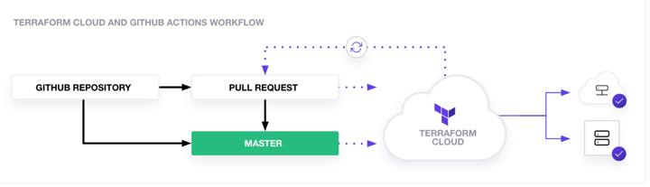

#Provision AWS ec2 instance 

provisioned three ec2 by existed modules using terraform cloud as remote backend. and automated Terraform with CI/CD pipeline in Git Action.

##work flow
Set up a complete GitHub Actions workflow to run terraform script automatically for every pull request and push on main branch.

