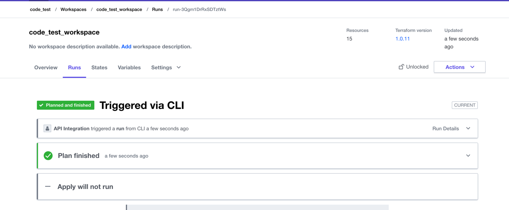

#integrate Terraform Cloud with GitHub Actions to automate the infrastructure provisioning of AWS EC2.

provisioned three ec2 by existed modules using terraform cloud as remote backend. and automated Terraform with CI/CD pipeline in Git Action.

##work flow

###This workflow will :
1.generate a plan for every pull requests ,and push 
2.Check if the input is formatted